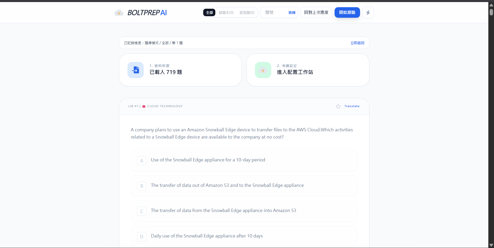
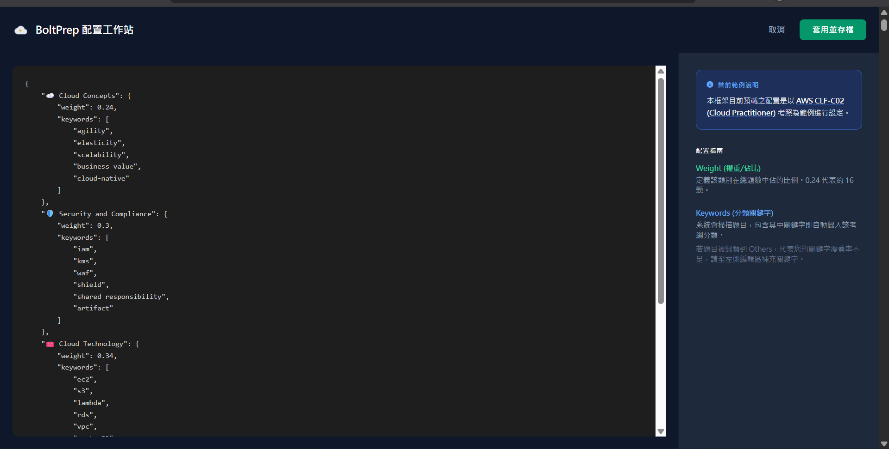

# BoltPrep AI

BoltPrep AI is a lightweight open-source quiz training app for certification prep.

It supports custom syllabus configuration, practice and exam modes, wrong-book review, star-marked questions, and optional bilingual translation.

## Screenshots

### 1) Main Quiz Experience

### 2) Syllabus Configuration Workstation

### 3) System Settings

## Key Features
- Custom syllabus and keyword-based question classification
- Practice mode and exam mode
- Separate wrong-book tracking for practice and exam
- Wrong-book retake flow with remove-on-correct option
- Star-marked questions for focused review
- Progress resume and jump-to-question
- Optional bilingual translation (Groq/Gemini)

## Quick Start (Local)

1. Clone this repository and open a terminal in the project folder.
2. Start a local server (choose one):
   - `python -m http.server 5500`
   - `py -m http.server 5500` (Windows)
3. Open:
   - `http://localhost:5500/index.html`

`localhost` means your own computer. Each user runs the app locally after cloning.

Important: do not open `index.html` with `file://`; use a local server.

## Project Structure

- `index.html`
- `src/constants.js`
- `src/logo.js`
- `src/api.js`
- `src/app.jsx`
- `src/components/navbar.js`
- `src/components/question-card.js`
- `src/components/settings-modal.js`

## Configuration

- Upload a question bank JSON from the main page.
- A ready-to-try sample is available at `docs/examples/sample-question-bank.json`.
- Optional API key for translation:
  - Groq (recommended): starts with `gsk_`
  - Gemini

## Try With Sample Data

1. Start the app locally and open `http://localhost:5500/index.html`.
2. Click the upload card (`1. 資料來源`).
3. Select `docs/examples/sample-question-bank.json`.
4. Start practicing immediately (translation API key is optional).

## Open Source

Contributions are welcome. See `CONTRIBUTING.md` for contribution guidelines.

## License

MIT. See `LICENSE`.
